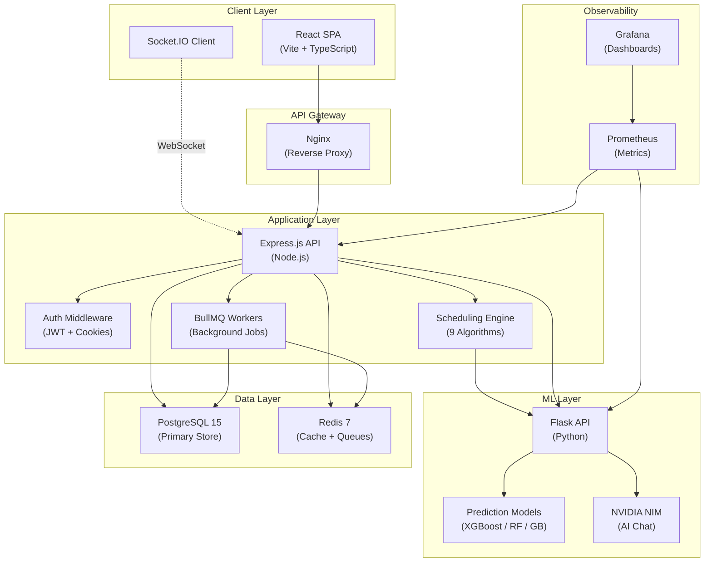
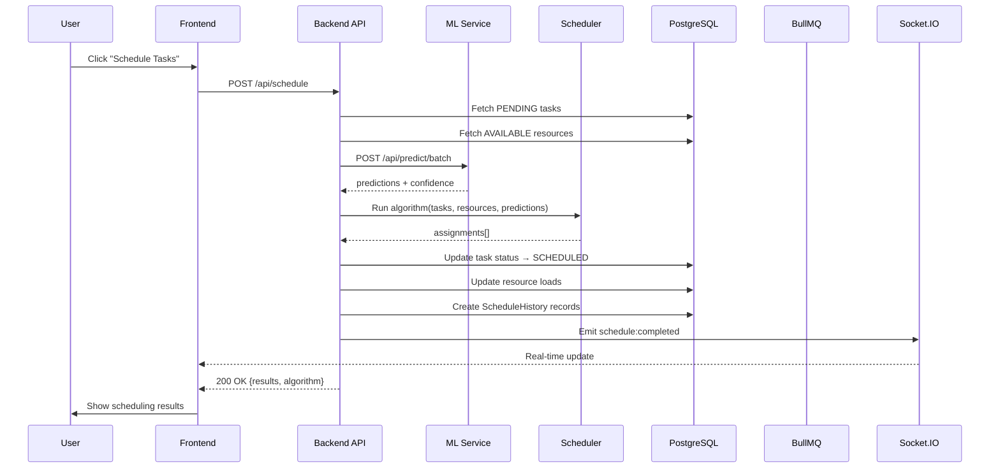
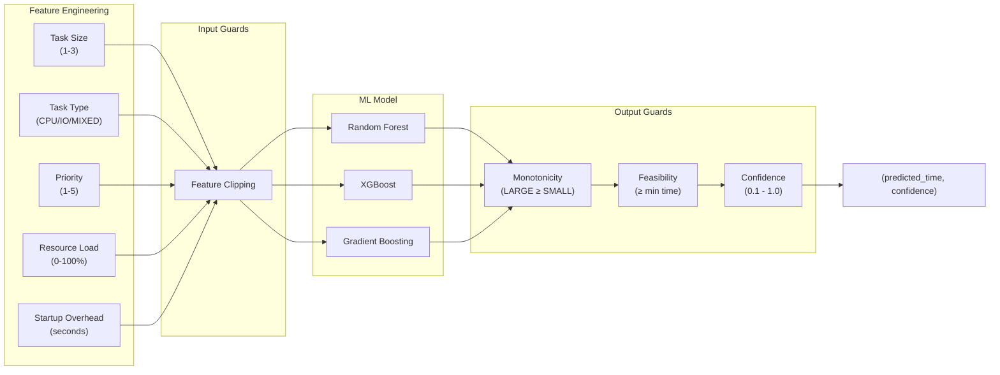
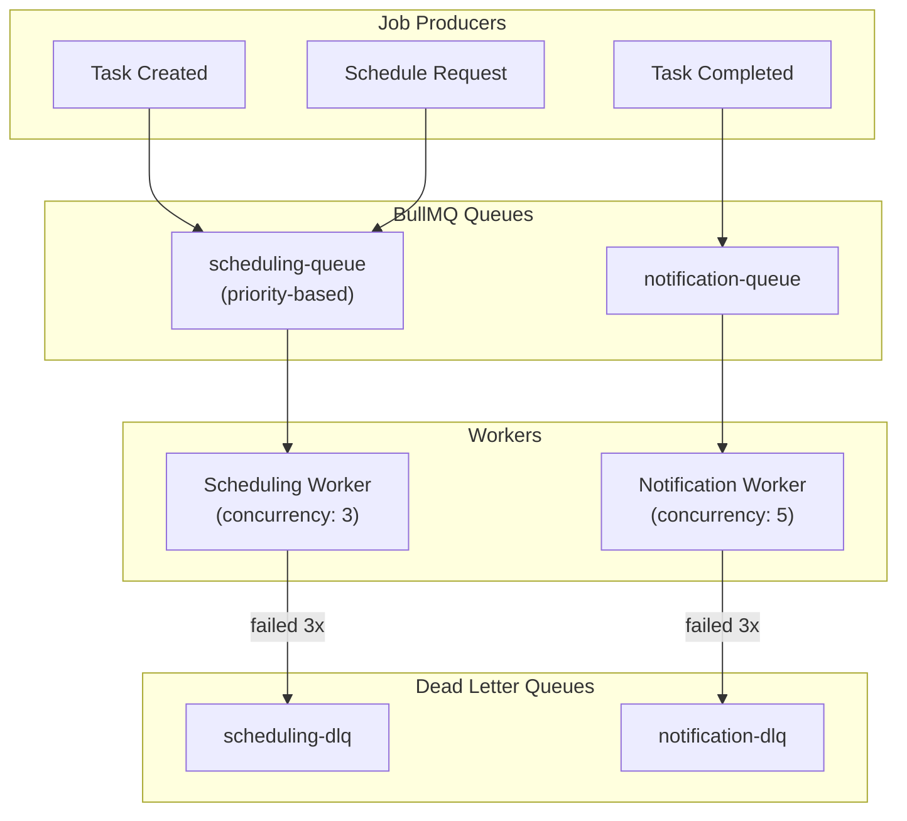
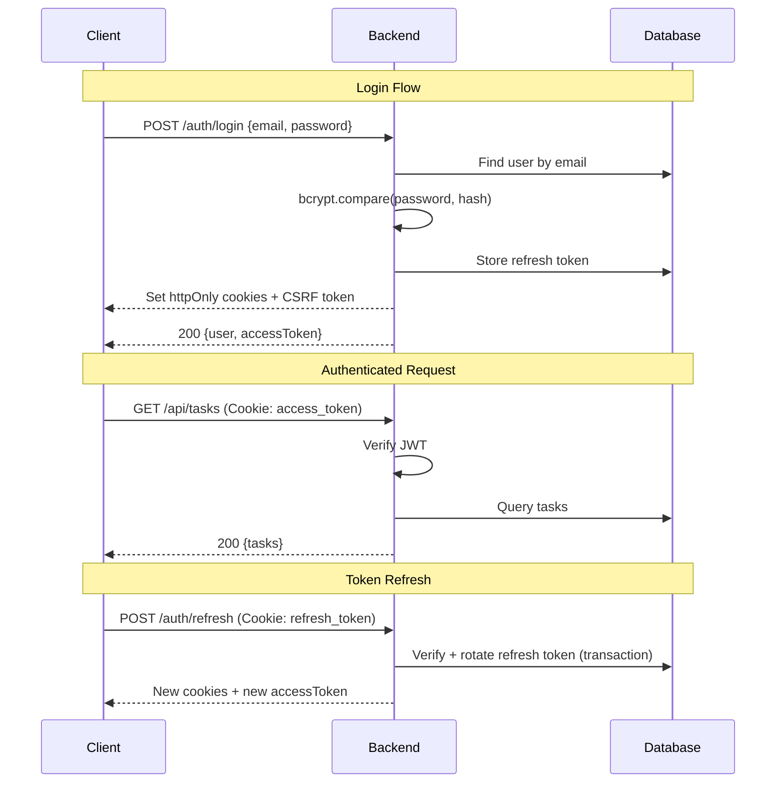
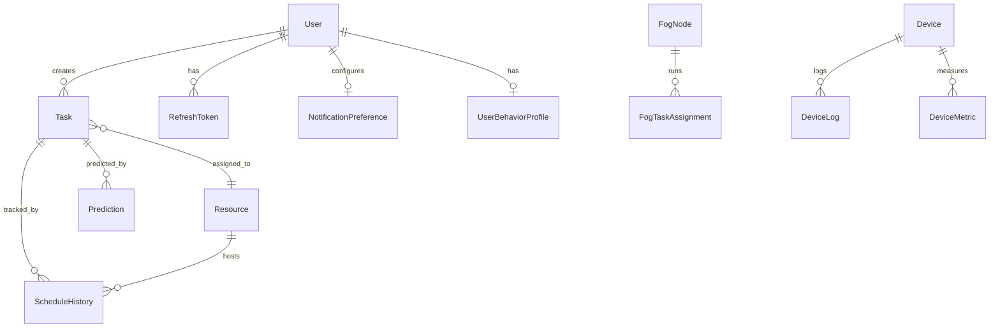

# AI Task Scheduling Platform — Architecture Documentation

## System Overview

A distributed, ML-enhanced task scheduling platform for fog/cloud computing environments. The system optimizes task-to-resource assignment using 9 scheduling algorithms including bio-inspired metaheuristics (IPSO, IACO) and machine learning predictions.

---

## High-Level Architecture



---

## Service Topology

| Service | Port | Technology | Purpose |
|---|---|---|---|
| Frontend | 3000 | React + Vite + Tailwind | SPA dashboard |
| Backend | 3001 | Node.js + Express + Prisma | REST API + WebSocket |
| ML Service | 5001 | Python + Flask + scikit-learn | Prediction + training |
| PostgreSQL | 5432 | PostgreSQL 15 | Primary data store |
| Redis | 6379 | Redis 7 + BullMQ | Caching + job queues |
| Prometheus | 9090 | Prometheus | Metrics collection |
| Grafana | 3002 | Grafana | Metrics visualization |
| Nginx | 80 | Nginx | Reverse proxy + static |

---

## Scheduling Lifecycle



---

## ML Prediction Pipeline



---

## Queue Topology



---

## Authentication Flow



---

## Scheduling Algorithms

| Algorithm | Type | Complexity | Best For |
|---|---|---|---|
| **ML Enhanced** | Hybrid | O(n·m) + ML latency | General use (default) |
| **Hybrid Heuristic (HH)** | Multi-objective | O(n·m·k) | Balanced delay + energy + reliability |
| **IPSO** | Particle Swarm | O(n·m·iterations) | Large search spaces |
| **IACO** | Ant Colony | O(n·m·iterations) | Path optimization |
| **Round Robin** | Deterministic | O(n) | Even distribution |
| **Min-Min** | Greedy | O(n·m) | Minimizing makespan |
| **FCFS** | Queue-based | O(n) | Order preservation |
| **EDF** | Priority | O(n log n) | Deadline-sensitive |
| **SJF** | Priority | O(n log n) | Throughput optimization |

---

## Data Model (Simplified)



---

## Technology Decisions

| Decision | Choice | Rationale |
|---|---|---|
| API Framework | Express.js | Mature ecosystem, Socket.IO integration, team familiarity |
| ORM | Prisma | Type-safe queries, migration system, middleware hooks |
| Auth Strategy | JWT + httpOnly cookies | Dual-layer: header for SPAs, cookies for CSRF safety |
| Queue System | BullMQ | Redis-backed, priority queues, DLQ, job deduplication |
| ML Framework | scikit-learn + XGBoost | Low-latency inference, simple deployment, good for tabular |
| Real-time | Socket.IO | Fallback transport, room-based scoping, reconnection |
| CSS | Tailwind CSS | Utility-first, consistent design system, small bundle |
| Validation | Zod | Runtime type safety, composable schemas, good TS integration |

---

## Scaling Strategy

### Phase 1: Vertical (Current)
- Single instance of each service
- Docker Compose orchestration
- PostgreSQL + Redis on same host

### Phase 2: Horizontal (50-500 users)
- Socket.IO Redis adapter (already configured)
- Multiple backend instances behind Nginx
- Read replicas for PostgreSQL
- Redis Sentinel for HA

### Phase 3: Cloud-Native (500+ users)
- Kubernetes with HPA
- Managed PostgreSQL (RDS/Cloud SQL)
- Redis Cluster
- CDN for static assets
- ML service autoscaling on GPU nodes

---

## Operational Runbook

### Health Checks
```
Backend:  GET /api/health
ML:       GET /api/health
Redis:    redis-cli ping
Postgres: pg_isready
```

### Key Metrics
- `http_request_duration_seconds` — API latency (p50, p95, p99)
- `ml_service_predictions_total` — Prediction throughput
- `bullmq_jobs_completed` — Queue processing rate
- `pg_connections_active` — Database connection pool

### Failure Recovery
| Failure | Impact | Recovery |
|---|---|---|
| ML Service down | Scheduler falls back to heuristics | Auto-detected via health check |
| Redis down | Queues pause, cache miss | BullMQ auto-reconnects, lock fails-closed |
| DB down | All writes fail | Prisma reconnects, auth returns 503 |
| Backend crash | Frontend shows error states | Docker restart policy: unless-stopped |

