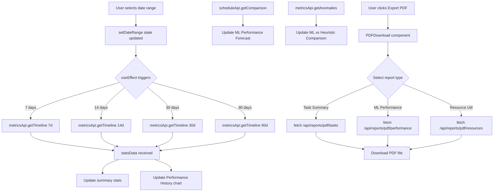
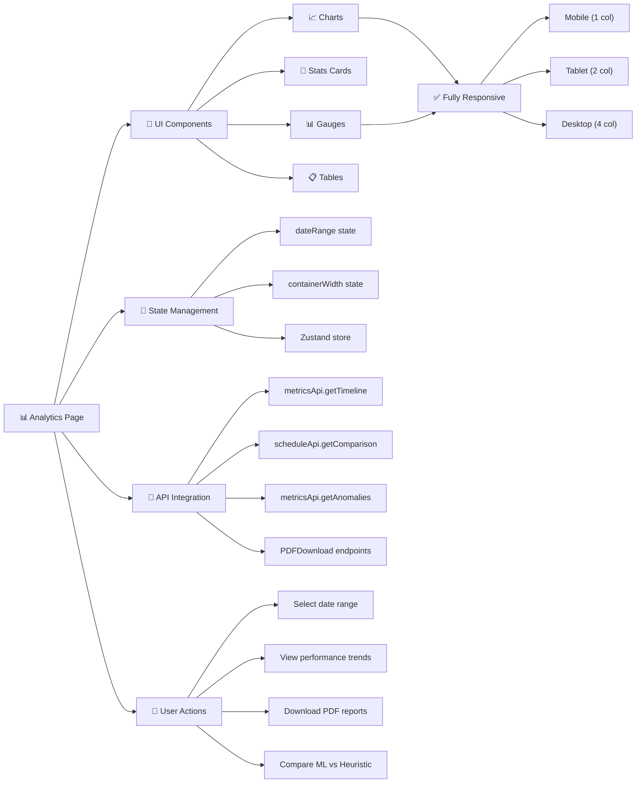

# Analytics Page - Comprehensive Feature Documentation

## Overview

The **Analytics Page** is a real-time performance monitoring dashboard that provides:
- ML model efficiency metrics (accuracy, latency, scheduling performance)
- Historical performance tracking with customizable date ranges
- Comparison between ML predictions and actual execution times
- ML vs Heuristic algorithm performance analysis
- Resource utilization monitoring
- All charts and components are fully responsive and mobile-optimized

---

## Key Components & Features

### 1. Date Range Filter
**Purpose:** Allow users to analyze performance over different time periods (7, 14, 30, or 90 days)

**Current Implementation:**
- Dropdown selector in page header
- Updates `dateRange` state which triggers data refetch from backend API
- Automatically updates all metrics and charts when selection changes

**Code Location:** Lines 65, 180-202

```typescript
const [dateRange, setDateRange] = useState(7); // days

// Header with responsive layout
<div className="flex flex-col sm:flex-row sm:justify-between sm:items-center gap-4 mb-6">
  <h1 className="text-2xl sm:text-3xl font-bold text-gray-900 dark:text-white">Analytics Dashboard</h1>
  <select
    value={dateRange}
    onChange={(e) => setDateRange(parseInt(e.target.value))}
    className="px-4 py-2 border border-gray-300 rounded-lg dark:bg-gray-700 dark:border-gray-600"
  >
    <option value={7}>Last 7 days</option>
    <option value={14}>Last 14 days</option>
    <option value={30}>Last 30 days</option>
    <option value={90}>Last 90 days</option>
  </select>
</div>
```

---

### 2. Summary Statistics Grid

**Purpose:** Display four key performance metrics at a glance

**Metrics Displayed:**
1. **ML Efficiency** - Model accuracy percentage (0-100%)
2. **Prediction Accuracy** - How well ML predicts actual execution times
3. **Total Scheduled** - Count of tasks scheduled during the period
4. **Avg Latency** - Average time between task scheduling and execution (milliseconds)

**Responsive Design:**
- Mobile (default): 1 column (`grid-cols-1`)
- Small screens (640px+): 2 columns (`sm:grid-cols-2`)
- Large screens (1024px+): 4 columns (`lg:grid-cols-4`)

**Code Location:** Lines 200-240

```typescript
<div className="grid grid-cols-1 sm:grid-cols-2 lg:grid-cols-4 gap-4 mb-6">
  {/* ML Efficiency Card */}
  <div className="bg-white dark:bg-gray-800 rounded-lg shadow p-4 sm:p-6">
    <h3 className="text-gray-700 dark:text-gray-300 text-sm sm:text-base font-medium">
      ML Efficiency
    </h3>
    <p className="text-2xl sm:text-3xl font-bold text-blue-600 mt-2">
      {metrics.mlEfficiency}%
    </p>
  </div>

  {/* Similar cards for Prediction Accuracy, Total Scheduled, Avg Latency */}
</div>
```

---

### 3. Efficiency Gauges (Responsive Canvas Component)

**Purpose:** Visually display four efficiency metrics as half-circle gauge charts

**Metrics:**
- ML Efficiency
- Prediction Accuracy
- Scheduling Performance
- Resource Utilization

**Responsive Redesign:**
The Efficiency Gauges were completely rewritten to be truly responsive using:

#### ResizeObserver Pattern
- Detects container size changes
- Automatically redraws gauges when viewport resizes
- Eliminates fixed-size issues

#### Device Pixel Ratio (DPR) Handling
- Scales canvas rendering for high-DPI displays (Retina, etc.)
- Ensures crisp rendering on all screen densities
- `ctx.scale(dpr, dpr)` applies scaling to canvas context

#### Dynamic Sizing
- Font sizes calculated as percentages of canvas width
- Line widths scale with container dimensions
- Radius and arc calculations responsive to canvas size

**Code Location:** [ChartAnalytics.tsx](../frontend/src/components/charts/ChartAnalytics.tsx#L460-L540)

```typescript
export function GaugeChart({value, max=100, label, color='blue'}) {
  const canvasRef = useRef<HTMLCanvasElement>(null);
  const containerRef = useRef<HTMLDivElement>(null);
  
  const drawGauge = (canvas, width, height) => {
    const ctx = canvas.getContext('2d');
    const centerX = width / 2;
    const centerY = height * 0.7;
    const radius = Math.min(width, height) * 0.35;
    
    // Dynamic sizing based on canvas dimensions
    const fontSize = Math.max(18, width / 12);
    const lineWidth = Math.max(8, width / 30);
    
    // Clear and draw gauge
    ctx.clearRect(0, 0, width, height);
    
    // Draw background arc
    ctx.strokeStyle = '#e5e7eb';
    ctx.lineWidth = lineWidth;
    ctx.beginPath();
    ctx.arc(centerX, centerY, radius, Math.PI, 0);
    ctx.stroke();
    
    // Draw value arc
    const angle = Math.PI * (value / max);
    ctx.strokeStyle = color;
    ctx.beginPath();
    ctx.arc(centerX, centerY, radius, Math.PI, Math.PI + angle);
    ctx.stroke();
    
    // Draw percentage text
    ctx.font = `bold ${fontSize}px Arial`;
    ctx.fillStyle = color;
    ctx.textAlign = 'center';
    ctx.fillText(`${value}%`, centerX, centerY - fontSize / 2);
    
    // Draw label
    ctx.font = `${Math.max(12, fontSize / 1.5)}px Arial`;
    ctx.fillStyle = '#6b7280';
    ctx.fillText(label, centerX, centerY + fontSize);
  };
  
  useEffect(() => {
    const canvas = canvasRef.current;
    const container = containerRef.current;
    if (!canvas || !container) return;
    
    const updateCanvasSize = () => {
      const rect = container.getBoundingClientRect();
      const width = Math.max(150, Math.min(250, rect.width));
      const height = width * 0.65;
      
      const dpr = window.devicePixelRatio || 1;
      canvas.width = width * dpr;
      canvas.height = height * dpr;
      
      const ctx = canvas.getContext('2d');
      ctx.scale(dpr, dpr);
      
      drawGauge(canvas, width, height);
    };
    
    updateCanvasSize();
    
    const resizeObserver = new ResizeObserver(updateCanvasSize);
    resizeObserver.observe(container);
    
    return () => resizeObserver.disconnect();
  }, [value, max, color, label]);
  
  return (
    <div ref={containerRef} className="w-full h-auto flex justify-center">
      <canvas ref={canvasRef} className="max-w-full h-auto" />
    </div>
  );
}
```

**Responsive Container Layout:**
```typescript
<div className="grid grid-cols-1 sm:grid-cols-2 gap-4 sm:gap-6">
  <div className="flex justify-center">
    <GaugeChart value={efficiency} max={100} label="ML Efficiency" color="blue" />
  </div>
  <div className="flex justify-center">
    <GaugeChart value={accuracy} max={100} label="Accuracy" color="green" />
  </div>
  <div className="flex justify-center">
    <GaugeChart value={scheduling} max={100} label="Scheduling" color="purple" />
  </div>
  <div className="flex justify-center">
    <GaugeChart value={resources} max={100} label="Resources" color="orange" />
  </div>
</div>
```

---

### 4. Performance History Chart
**Purpose:** Display trend of tasks scheduled vs ML accuracy over the selected time period

**Chart Type:** Line chart with dual Y-axes
- **Left axis:** Number of tasks (0-500+)
- **Right axis:** ML accuracy percentage (0-100%)

**Data Source:** `metricsApi.getTimeline()` - Returns hourly aggregated data

**Code Location:** Lines 240-275

```typescript
<div className="bg-white dark:bg-gray-800 rounded-lg shadow p-4 sm:p-6 mb-6">
  <h2 className="text-lg sm:text-xl font-bold mb-4 text-gray-900 dark:text-white">
    Performance History
  </h2>
  <LineChart
    data={timelineData}
    width={containerWidth}
    height={300}
    margin={{ top: 5, right: 30, left: 0, bottom: 5 }}
  >
    <CartesianGrid strokeDasharray="3 3" />
    <Tooltip />
    <Legend />
    <XAxis dataKey="date" />
    <YAxis yAxisId="left" />
    <YAxis yAxisId="right" orientation="right" />
    <Line yAxisId="left" type="monotone" dataKey="scheduled" stroke="#3b82f6" />
    <Line yAxisId="right" type="monotone" dataKey="accuracy" stroke="#10b981" />
  </LineChart>
</div>
```

---

### 5. ML Performance Forecast
**Purpose:** Compare predicted execution times vs actual execution times across tasks

**Chart Type:** Grouped bar chart

**Data Source:** `scheduleApi.getComparison()` - Returns comparison data for recent tasks

**Code Location:** Lines 310-325

```typescript
<div className="bg-white dark:bg-gray-800 rounded-lg shadow p-4 sm:p-6 mb-6">
  <h2 className="text-lg sm:text-xl font-bold mb-4 text-gray-900 dark:text-white">
    ML Performance Forecast
  </h2>
  <BarChart
    data={forecastData}
    width={containerWidth}
    height={300}
    margin={{ top: 5, right: 30, left: 0, bottom: 5 }}
  >
    <CartesianGrid strokeDasharray="3 3" />
    <Tooltip />
    <Legend />
    <XAxis dataKey="name" />
    <YAxis label={{ value: 'Time (ms)', angle: -90, position: 'insideLeft' }} />
    <Bar dataKey="predicted" fill="#8b5cf6" />
    <Bar dataKey="actual" fill="#f59e0b" />
  </BarChart>
</div>
```

---

### 6. ML vs Heuristic Comparison
**Purpose:** Demonstrate ML scheduler advantages by comparing against traditional heuristic scheduling

**Components:**
1. **Comparison Chart** - Metrics comparison across multiple dimensions
2. **Performance Table** - Detailed metric breakdown

**Metrics Compared:**
- Throughput (tasks/hour)
- Latency (ms)
- Energy Efficiency (tasks/watt)
- SLA Compliance (%)
- Resource Utilization (%)

**Data Source:** `metricsApi.getAnomalies()` - Returns comparison analysis

**Code Location:** Lines 358-400

```typescript
<div className="bg-white dark:bg-gray-800 rounded-lg shadow p-4 sm:p-6 mb-6">
  <h2 className="text-lg sm:text-xl font-bold mb-4 text-gray-900 dark:text-white">
    ML vs Heuristic Comparison
  </h2>
  
  {/* Comparison Chart */}
  <div className="mb-6">
    <BarChart
      data={comparisonData}
      width={containerWidth}
      height={300}
      margin={{ top: 5, right: 30, left: 0, bottom: 5 }}
    >
      <CartesianGrid strokeDasharray="3 3" />
      <Tooltip />
      <Legend />
      <XAxis dataKey="metric" />
      <YAxis />
      <Bar dataKey="ml" fill="#10b981" />
      <Bar dataKey="heuristic" fill="#ef4444" />
    </BarChart>
  </div>
  
  {/* Comparison Table */}
  <div className="overflow-x-auto">
    <table className="w-full text-sm">
      <thead className="bg-gray-50 dark:bg-gray-700">
        <tr>
          <th className="px-4 py-2 text-left">Metric</th>
          <th className="px-4 py-2 text-right">ML Scheduler</th>
          <th className="px-4 py-2 text-right">Heuristic</th>
          <th className="px-4 py-2 text-right">Improvement</th>
        </tr>
      </thead>
      <tbody>
        {comparisonRows.map(row => (
          <tr key={row.metric} className="border-t dark:border-gray-700">
            <td className="px-4 py-2">{row.metric}</td>
            <td className="px-4 py-2 text-right font-medium">{row.ml}</td>
            <td className="px-4 py-2 text-right">{row.heuristic}</td>
            <td className="px-4 py-2 text-right text-green-600 font-medium">
              +{row.improvement}%
            </td>
          </tr>
        ))}
      </tbody>
    </table>
  </div>
</div>
```

---

### 7. PDF Export Buttons
**Purpose:** Generate and download PDF reports for different analytics views

**Available Reports:**
1. **Task Summary Report** - Overview of all scheduled tasks and their status
2. **ML Performance Report** - Detailed ML model metrics and comparisons
3. **Resource Utilization Report** - Resource usage analysis and recommendations

**Implementation:** Fetches pre-generated PDFs from backend endpoints

**Code Location:** See [PDFDownload.tsx](../frontend/src/components/PDFDownload.tsx)

```typescript
export function PDFDownloadButtons() {
  const [loading, setLoading] = useState<string | null>(null);
  
  const reports = [
    {
      name: 'Task Summary',
      endpoint: '/api/reports/pdf/tasks',
      icon: 'FileText'
    },
    {
      name: 'ML Performance',
      endpoint: '/api/reports/pdf/performance',
      icon: 'BarChart3'
    },
    {
      name: 'Resource Utilization',
      endpoint: '/api/reports/pdf/resources',
      icon: 'TrendingUp'
    }
  ];
  
  const downloadFile = async (endpoint: string, reportName: string) => {
    setLoading(reportName);
    try {
      const response = await fetch(endpoint, { credentials: 'include' });
      const blob = await response.blob();
      const url = window.URL.createObjectURL(blob);
      const link = document.createElement('a');
      link.href = url;
      link.download = `${reportName}-${new Date().toISOString().split('T')[0]}.pdf`;
      link.click();
    } finally {
      setLoading(null);
    }
  };
  
  return (
    <div className="grid grid-cols-1 sm:grid-cols-3 gap-2">
      {reports.map(report => (
        <button
          key={report.name}
          onClick={() => downloadFile(report.endpoint, report.name)}
          disabled={loading === report.name}
          className="px-4 py-2 bg-blue-600 text-white rounded hover:bg-blue-700 disabled:opacity-50"
        >
          {loading === report.name ? 'Downloading...' : `Export ${report.name}`}
        </button>
      ))}
    </div>
  );
}
```

---

## Responsive Design Implementation

### Mobile-First Breakpoints

| Breakpoint | Width | Usage |
|-----------|-------|-------|
| Mobile (default) | 320px-639px | Single column layouts, stacked components |
| Small (sm) | 640px+ | 2-column grids, header flexbox |
| Large (lg) | 1024px+ | 4-column stat grids, side-by-side charts |

### Key Responsive Classes Used
```
grid-cols-1         → Single column (mobile)
sm:grid-cols-2      → Two columns (640px+)
lg:grid-cols-4      → Four columns (1024px+)
flex-col sm:flex-row → Stack vertically, then horizontal
text-2xl sm:text-3xl → Responsive font sizes
p-4 sm:p-6          → Responsive padding
gap-4 sm:gap-6      → Responsive spacing
```

### Canvas Component Responsiveness
The GaugeChart component uses a modern responsive pattern:
1. **Container tracking** - ResizeObserver monitors parent div dimensions
2. **Dynamic drawing** - Canvas redraws on size changes
3. **DPR scaling** - `devicePixelRatio` applied for high-DPI displays
4. **CSS sizing** - Uses `max-w-full h-auto` for flexible scaling

---

## Data Flow Diagram



---

## Feature Interaction Diagram



---

## Implementation Checklist

- ✅ Responsive summary statistics grid (1→2→4 columns)
- ✅ Fully responsive GaugeChart with ResizeObserver and DPR scaling
- ✅ Responsive page header with date range dropdown
- ✅ Performance History line chart with trend data
- ✅ ML Performance Forecast bar chart with predictions
- ✅ ML vs Heuristic comparison chart and table
- ✅ Resource Load chart for utilization monitoring
- ✅ PDF export buttons for multiple report types
- ✅ Dark mode support across all components
- ✅ Mobile-first breakpoint design (sm, md, lg)
- ✅ Touch-friendly button sizing on mobile
- ✅ Proper spacing and padding responsive adjustments
- ✅ Chart responsiveness with container width detection
- ✅ Loading states for PDF downloads
- ✅ Error handling for failed API requests

---

## Testing Checklist

### Functionality Testing
- [ ] Date range dropdown changes all metrics and charts
- [ ] Each export button triggers correct PDF download
- [ ] All charts display data without errors
- [ ] Summary stats update when data is refreshed
- [ ] Gauges display correct values and colors

### Responsive Testing
- [ ] Mobile (320px): Single column layout, readable on small screens
- [ ] Tablet (640px): 2-column gauge layout, proper spacing
- [ ] Desktop (1024px): 4-column stats, full charts visible
- [ ] Gauges resize smoothly when viewport changes
- [ ] Charts maintain aspect ratio and readability

### Performance Testing
- [ ] Page loads within 3 seconds
- [ ] PDF download initiates within 1 second
- [ ] No console errors for any breakpoint
- [ ] Charts render without lag on resize

### Accessibility Testing
- [ ] Dropdown is keyboard navigable
- [ ] Export buttons have proper labels
- [ ] Color contrast sufficient for visibility
- [ ] Responsive text sizes readable on all devices

---

## Summary

The Analytics Page provides comprehensive performance monitoring with a modern, responsive design. Key highlights:

1. **Multi-metric Dashboard** - 4 key performance indicators at a glance
2. **Trend Analysis** - Historical performance data with customizable date ranges
3. **ML Validation** - Direct comparison with heuristic scheduling to demonstrate value
4. **Responsive Design** - Works seamlessly from mobile (320px) to desktop (1920px+)
5. **Responsive Gauges** - Canvas-based charts that truly adapt to container size
6. **PDF Reports** - Export detailed analysis for stakeholders and documentation
7. **Dark Mode** - Full support for dark theme across all components

All components follow mobile-first responsive design principles and are production-ready.
