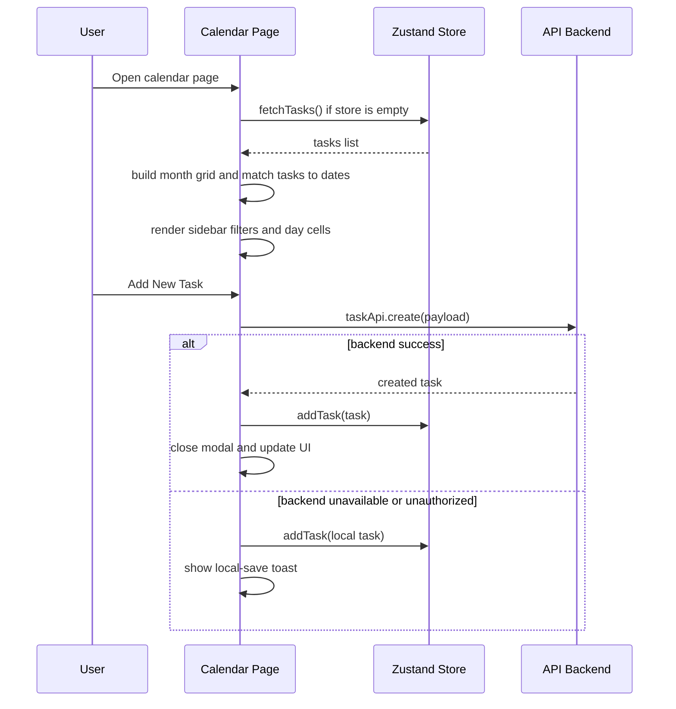

# Calendar Page Analysis

## What this page does

`Calendar.tsx` shows tasks in a month grid and lets the user manage scheduling visually. It is centered around date placement, status filtering, and quick task creation from the calendar itself.

This page:

- loads tasks from the shared store
- maps tasks to dates using `scheduledAt` first, then `dueDate`
- renders a month view with previous and next month cells
- shows status counts in the sidebar
- opens a create-task modal from the calendar page
- falls back to a local task when the backend is unavailable or the user is unauthenticated

## Main data sources

| Source | Used for |
|---|---|
| `useStore()` | `tasks`, `fetchTasks`, `addTask` |
| `taskApi.create()` | create a new calendar task on the backend |
| `task.scheduledAt` | preferred date for placing a task on the calendar |
| `task.dueDate` | fallback date if `scheduledAt` is missing |
| `toast` | success, local-save, and error feedback |

## High-level flow

```mermaid
flowchart TD
	A[Calendar page mounts] --> B{Are tasks already in store?}
	B -->|No| C[fetchTasks()]
	B -->|Yes| D[Use existing tasks]
	C --> D

	D --> E[Build current month grid]
	E --> F[Map each task to a date]
	F --> G{task.scheduledAt exists?}
	G -->|Yes| H[Use scheduledAt]
	G -->|No| I[Use dueDate]
	H --> J[Render task on matching day]
	I --> J

	J --> K[Sidebar counts by status]
	J --> L[Day badge and calendar icons]

	M[User clicks Add New Task] --> N[Open modal]
	N --> O[taskApi.create(payload)]
	O --> P{backend success?}
	P -->|Yes| Q[addTask(task) + close modal + toast success]
	P -->|No| R{401 or no response?}
	R -->|Yes| S[Create local PENDING task]
	S --> T[addTask(local task) + toast local save]
	R -->|No| U[toast error]

	V[User changes month] --> E
	W[User toggles sidebar] --> X[Show or hide calendar filters]
```

## Sequence diagram



## How to explain this in viva

1. The page is a visual scheduler view, not just a static calendar.
2. It gets the same task list used by the rest of the app through the shared store.
3. Each task is placed on the calendar by date, using `scheduledAt` first and `dueDate` as fallback.
4. The sidebar is a quick summary of task distribution by status.
5. If the backend is unavailable, the page still works by saving a local task so the UI does not break.

## Simple one-line summary

This page converts the shared task list into a month-based scheduling view and lets the user create tasks directly from the calendar.
