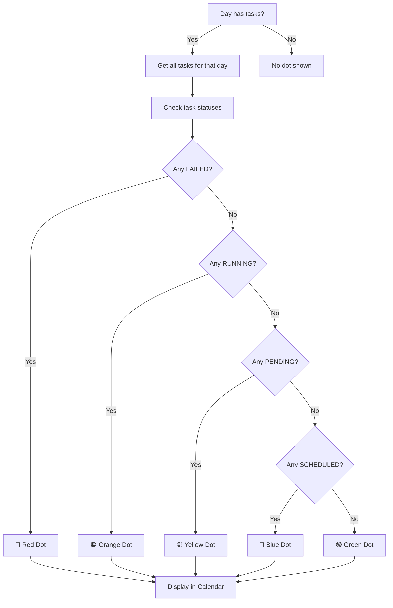

# Calendar Page - Updated Features

## Overview

The Calendar page displays tasks in a visual month grid and lets users manage task scheduling. It now includes **status-based color indicators** for quick visual identification of task urgency.

## Key Features Added

### 1. Status-Based Color Dots 🎨

Each day with tasks shows a **colored dot** next to the calendar icon that indicates the **most urgent task status** on that day.

**Color Mapping:**
- 🔴 **Red** = FAILED status (urgent attention needed)
- 🟠 **Orange** = RUNNING status (in progress)
- 🟡 **Yellow** = PENDING status (waiting to start)
- 🔵 **Blue** = SCHEDULED status (scheduled but not started)
- 🟢 **Green** = COMPLETED status (all done)

**Priority Logic:** If multiple statuses exist on the same day, the most urgent takes priority:
```
FAILED > RUNNING > PENDING > SCHEDULED > COMPLETED
```

## How It Works - Visual Flow



## Code Structure

### Calendar Day Cell
```
Day Cell:
├─ Day number (1-31)
├─ Calendar Icon + Status Dot
│  ├─ Red dot (FAILED)
│  ├─ Orange dot (RUNNING)
│  ├─ Yellow dot (PENDING)
│  ├─ Blue dot (SCHEDULED)
│  └─ Green dot (COMPLETED)
└─ Hover actions (more options)
```

### Task Status Check Function
```typescript
const getCalendarDotColor = (dayTasks: Task[]) => {
  // Returns color class based on most urgent status
  if (dayTasks.some(t => t.status === 'FAILED')) 
    return 'bg-red-500';
  if (dayTasks.some(t => t.status === 'RUNNING')) 
    return 'bg-orange-500';
  if (dayTasks.some(t => t.status === 'PENDING')) 
    return 'bg-yellow-500';
  if (dayTasks.some(t => t.status === 'SCHEDULED')) 
    return 'bg-blue-500';
  if (dayTasks.some(t => t.status === 'COMPLETED')) 
    return 'bg-emerald-500';
  return 'bg-primary-500';
};
```

## Example Scenarios

### Scenario 1: Mixed Status Day
**Date:** May 15, 2026

| Task | Status |
|------|--------|
| Deploy API | RUNNING (Orange) |
| Write Tests | PENDING (Yellow) |
| Review PR | COMPLETED (Green) |

**Result:** 🟠 **Orange dot** shows (RUNNING is more urgent than PENDING)

### Scenario 2: All Completed
**Date:** May 20, 2026

| Task | Status |
|------|--------|
| Database migration | COMPLETED |
| Update docs | COMPLETED |

**Result:** 🟢 **Green dot** shows

### Scenario 3: Critical Failure
**Date:** May 25, 2026

| Task | Status |
|------|--------|
| Build backup | FAILED (Red) |
| Restore cache | PENDING (Yellow) |

**Result:** 🔴 **Red dot** shows (FAILED is highest priority)

## Filtering & Sidebar

The sidebar shows task counts by status with matching colors:

```
Task Filters:
├─ 🔵 Scheduled: 5
├─ 🟡 Pending: 12
├─ 🟢 Completed: 45
└─ 🔴 Failed: 2
```

## How to Use

1. **View a Month:** Calendar displays current month with all task days
2. **Look for Colored Dots:** Quickly identify days with tasks and their urgency
3. **Understand Priority:** Darker/warmer colors = more urgent
4. **Create Tasks:** Click "Add New Task" button to create from calendar
5. **Track Progress:** Use sidebar to see counts by status at a glance

## Data Sources

| Source | Purpose |
|--------|---------|
| `useStore()` | Get tasks list |
| `task.scheduledAt` | Primary date for task placement |
| `task.dueDate` | Fallback date if scheduledAt missing |
| `task.status` | Determine dot color |

## File Location

**File:** `frontend/src/pages/Calendar.tsx`

**Key Function:** `getCalendarDotColor(dayTasks: Task[])`

**Updated Component:** Calendar day cell rendering (around line 430)
