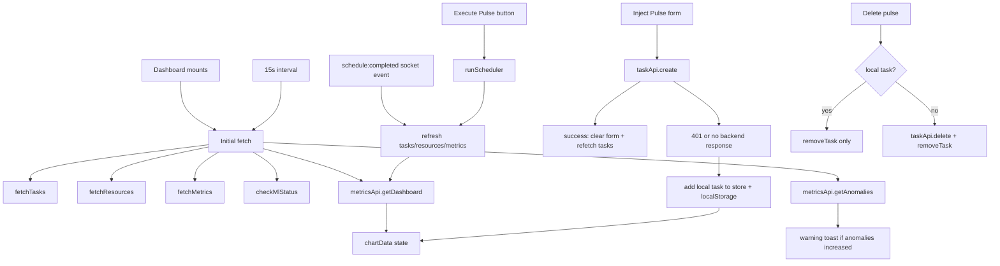
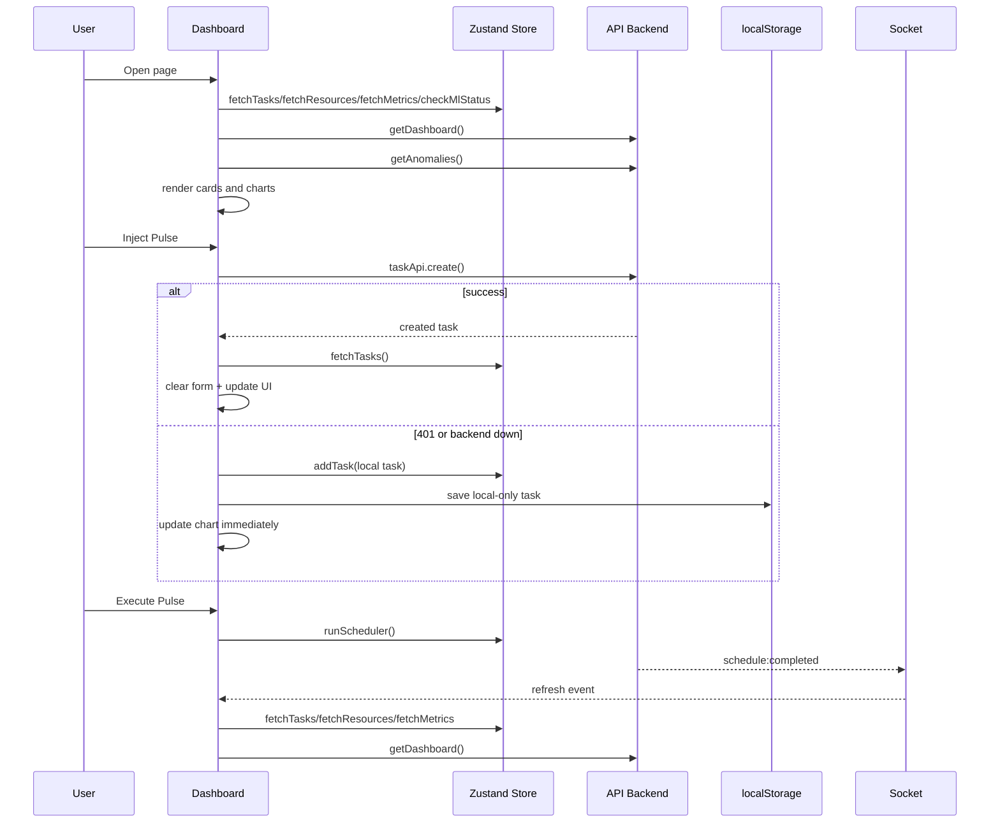

# Dashboard Page Analysis

## What this page does

`Dashboard.tsx` is the main control and monitoring screen for the ML Task Scheduler. It combines live system metrics, task ingestion, scheduling actions, queue management, and routing visibility into one dashboard.

The page is not just presentational. It actively:

- polls the backend every 15 seconds
- refreshes data after socket events
- lets the user create and delete tasks
- triggers the scheduler
- keeps a local fallback task cache for offline or unauthenticated use
- overlays local-only tasks onto the performance chart so the UI stays consistent

## Main data sources

| Source | Used for |
|---|---|
| `useStore()` | tasks, resources, metrics, ML availability, scheduler action, local task mutation |
| `metricsApi.getDashboard()` | the main area chart data for load and throughput |
| `metricsApi.getAnomalies()` | anomaly detection toast notifications |
| `taskApi.create()` / `taskApi.delete()` | task ingestion and removal on the backend |
| `socket.on('schedule:completed')` | refresh after scheduling finishes |
| `localStorage` | fallback storage for local-only tasks |

## High-level flow

## How the page works

### 1. Boot and refresh cycle

When the dashboard loads, it runs one fetch immediately and then repeats it every 15 seconds. The fetch does four things in parallel:

- loads tasks
- loads resources
- loads metrics
- checks whether the ML service is available

After that, it separately fetches dashboard chart data and anomalies. If anomaly count increases, the page shows a warning toast.

If the fetch fails, the page keeps the chart alive with a default slot layout and overlays any local-only tasks from `localStorage`.

### 2. Chart logic

The page renders two chart surfaces:

- a small workload sparkline in the “Cluster Workload” card
- a larger dual-area chart in “Processing Matrix”

The main chart shows two signals:

- `load` in green
- `throughput` in blue

The data is grouped into 4-hour slots: `00:00`, `04:00`, `08:00`, `12:00`, `16:00`, and `20:00`.

Local tasks are projected into those same slots so the chart still reflects recent task activity even if the backend is unavailable.

### 3. Task ingestion

When the user fills in the form and clicks “Inject Pulse”:

1. the page builds a task payload
2. it tries to create the task on the backend
3. if that succeeds, it clears the form and refreshes tasks
4. if the backend returns 401 or is unreachable, it creates a local task instead
5. the local task is stored in the Zustand store and persisted to `localStorage`
6. the chart is updated immediately to reflect the new task

That fallback is important because the dashboard is designed to remain useful even in partial-offline or unauthenticated mode.

### 4. Scheduling

The “Execute Pulse” button calls `runScheduler()` from the store. After scheduling, the dashboard refreshes task, resource, and metric data. A socket event named `schedule:completed` does the same refresh path after the scheduler finishes on the backend.

### 5. Deletion

Deletion is split into two cases:

- local tasks are removed only from the store and localStorage
- server tasks are deleted through `taskApi.delete()` and then removed from the store

That lets the page clean up both real and offline-created items consistently.

## Sequence diagram

## UI map

| Section | Purpose | Data behind it |
|---|---|---|
| Header | page title and refresh / schedule actions | `resources.length`, `scheduling`, `pendingTasks.length` |
| Neural Optimizer card | ML availability and prediction reliability | `mlAvailable`, `metrics.performance.mlAccuracy` |
| Cluster Workload | overall utilization snapshot + sparkline | `metrics.resources.avgLoad`, `chartData` |
| Processing Matrix | primary area chart of load and throughput | `chartData` |
| Metric cards | fast operational KPIs | `metrics.tasks.total`, `resources.length`, `metrics.resources.avgLoad`, `metrics.performance.avgExecutionTime` |
| Layer Allocation | resource distribution pie chart | `metrics.resources.distribution` |
| Active Pulse | current queue preview | pending, running, scheduled tasks |
| Pulse Ingestion | create new task | `taskApi.create()` or local fallback |
| Recent Pulse Transactions | audit-style task table | `tasks.slice(0, 10)` |

## Practical summary

This page behaves like a live operations console. It watches backend state, keeps a local fallback path when the server is unavailable, and uses the same task state to drive the queue, the logs table, the chart overlays, and the scheduler actions.
