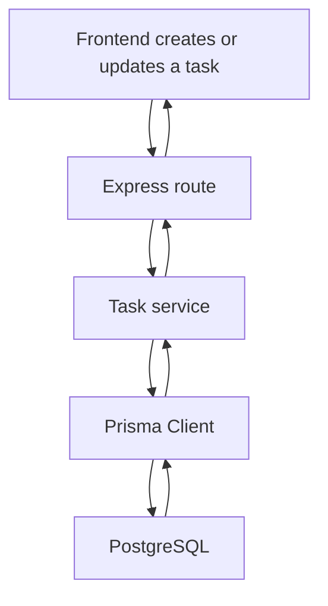
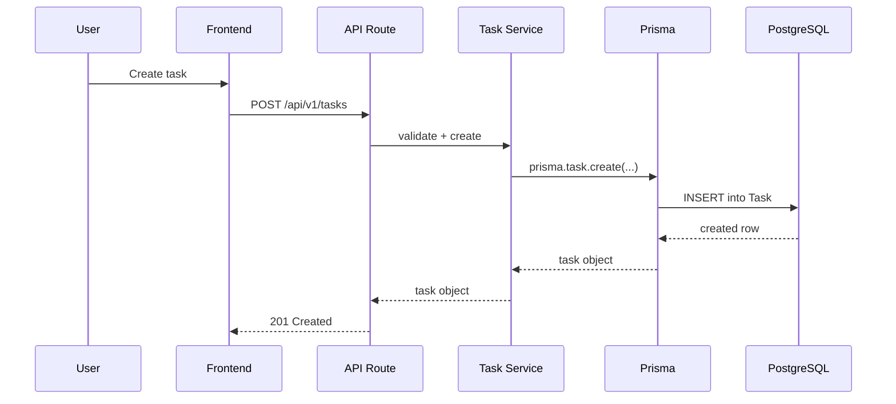

# Database Working Guide

## Overview

This project uses **PostgreSQL** as the persistent database and **Prisma** as the ORM layer in the backend.

The Prisma schema is the source of truth for the data model. Backend code reads and writes through `prisma` client calls, and the database is synchronized from `backend/prisma/schema.prisma`.

## Main Pieces

| Piece | Purpose |
|---|---|
| PostgreSQL | Stores tasks, resources, users, scheduling history, and ML metadata |
| Prisma schema | Defines tables, relations, enums, and indexes |
| Prisma Client | Type-safe database access in the Node.js backend |
| Docker Compose | Runs Postgres, backend, frontend, Redis, and workers together |
| Backend startup | Pushes the Prisma schema into the database before the API starts |

## Database Flow



## How Task Data Is Stored

The `Task` model is the core table for the app. It stores:

- task name, type, size, priority, and status
- optional `dueDate` and `scheduledAt`
- execution data like `predictedTime` and `actualTime`
- links to a resource and user
- soft-delete support through `deletedAt`

Other important tables include:

- `Resource` for compute nodes
- `User` for authentication and ownership
- `ScheduleHistory` for scheduling events
- `Prediction` for ML prediction output
- `SystemMetrics` for metrics and monitoring data

## Startup Behavior

The backend container now runs a schema sync before starting the API:

```bash
npx prisma db push --skip-generate && exec node dist/index.js
```

That means:

1. if the database is empty, Prisma creates the missing tables
2. if the database already matches the schema, nothing changes
3. the API only starts after the schema is ready

This is why fresh Docker volumes no longer fail on task creation with `public.Task does not exist`.

## Request Path For Task Creation



## Why 503 Can Happen

The backend returns `503 Service Unavailable` when Prisma raises a database-level error. In this project, the most common cause was a missing schema on a fresh database.

After the bootstrap change, this should only happen if:

- Postgres is down
- the connection string is wrong
- the database is corrupted or unavailable

## How To Recover A Fresh Database

If you reset the database volume and want to rebuild the schema manually, run:

```bash
docker compose exec backend npx prisma db push
```

If you restart the stack normally, the backend now performs that step automatically.

## Practical Summary

The backend uses Prisma to map app models to Postgres tables. Task creation goes through the API, into the task service, and then into PostgreSQL. The Docker startup now ensures the schema exists before the API starts, which keeps new databases usable without manual setup.