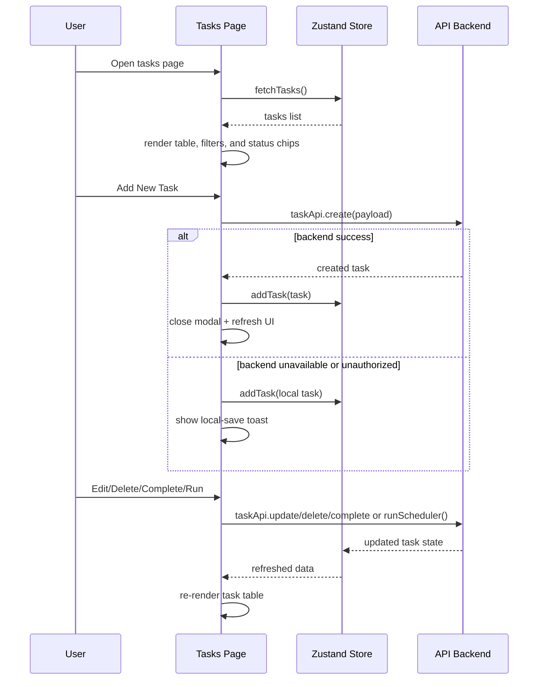

# Tasks Page Analysis

## What this page does

`Tasks.tsx` is the main task management page. It is the control center for creating, filtering, editing, deleting, completing, and scheduling tasks.

This page:

- fetches tasks from the shared store every 5 seconds
- supports search and status filtering
- opens the task creation modal
- opens the task edit modal
- deletes tasks with confirmation
- marks tasks as completed
- runs the scheduler for selected tasks
- supports a local fallback when task creation cannot reach the backend
- includes a Google Calendar picker inside the create modal

## Main data sources

| Source | Used for |
|---|---|
| `useStore()` | `tasks`, `tasksLoading`, `fetchTasks`, `addTask`, `updateTask`, `removeTask`, `runScheduler` |
| `taskApi.create()` | create a new task on the backend |
| `taskApi.delete()` | delete a task from the backend |
| `taskApi.complete()` | mark a task as completed |
| `TaskEditModal` | editing an existing task |
| `ConfirmDialog` | delete and complete confirmations |
| Google Calendar OAuth | optional due-date picking inside the create form |

## High-level flow

```mermaid
flowchart TD
	A[Tasks page mounts] --> B[fetchTasks()]
	B --> C[Repeat every 5 seconds]
	C --> B

	B --> D[Render filtered task table]
	D --> E[Search input]
	D --> F[Status filter]
	D --> G[Type filter]

	H[User clicks Add New Task] --> I[Open TaskFormModal]
	I --> J[Fill task details]
	J --> K[taskApi.create(payload)]
	K --> L{backend success?}
	L -->|Yes| M[addTask(task) + close modal + toast success]
	L -->|No| N{401 or no response?}
	N -->|Yes| O[Create local PENDING task]
	O --> P[addTask(local task) + toast local save]
	N -->|No| Q[toast error]

	R[User clicks Edit] --> S[Open TaskEditModal]
	S --> T[updateTask(updated task)]

	U[User clicks Delete] --> V[ConfirmDialog]
	V --> W[taskApi.delete(id)]
	W --> X[removeTask(id)]

	Y[User clicks Complete] --> Z[ConfirmDialog]
	Z --> AA[taskApi.complete(id, actualTime)]
	AA --> AB[fetchTasks() refresh]

	AC[User clicks Run] --> AD[runScheduler([task.id])]
```

## Sequence diagram



## How to explain this in viva

1. The page is the operational task dashboard.
2. It keeps the list fresh by polling the store every 5 seconds.
3. Create, delete, and complete actions go through the backend first, with a local fallback only for creation.
4. Editing is done through a modal, which updates the shared store after save.
5. The page is the main place where task lifecycle actions are performed before tasks show up in calendar or scheduler views.

## Simple one-line summary

This page is the task lifecycle controller: it creates, updates, deletes, completes, filters, and schedules tasks while keeping the store and UI in sync.
