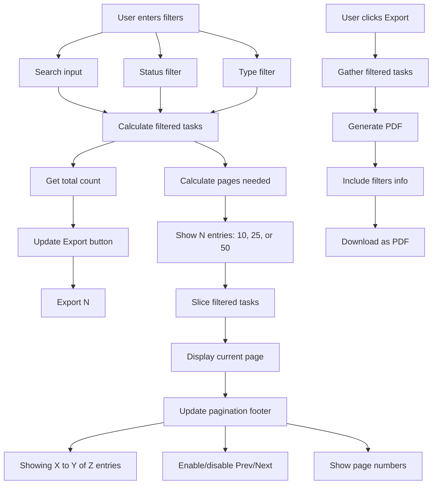
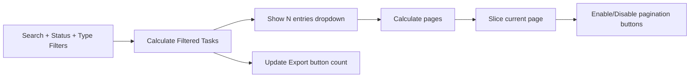

# Tasks Page - Updated Features

## Overview

The Tasks page is the control center for task management. It now includes **pagination controls**, **show N entries dropdown**, **PDF export**, and **filtered entity counting**.

## Key Features Added

### 1. Show N Entries Dropdown 📊

Users can choose how many tasks to display per page.

**Options:**
- 10 entries (default)
- 25 entries
- 50 entries

**How it works:**
```
User selects "25 entries"
    ↓
Table shows 25 tasks per page
    ↓
Footer updates: "Showing 1 to 25 of 145 entries"
    ↓
Pagination buttons appear for remaining pages
```

### 2. Dynamic Pagination Controls ⬅️➡️

Navigate between pages using:
- **Prev button** (⬅️) - Go to previous page
- **Page buttons** (1, 2, 3...) - Jump to specific page
- **Next button** (➡️) - Go to next page

Buttons are **disabled** when not applicable (e.g., Prev on page 1).

### 3. PDF Export with Filtered Count 📄

Click the **Export** button to download filtered tasks as PDF.

**Button shows:** `Export (N)` where N = number of filtered tasks
- If 100 total tasks but 25 match filters → `Export (25)`
- PDF includes: timestamp, filter criteria, all matching tasks

**PDF Contents:**
```
Tasks Export Report
Generated: 5/11/2026, 2:30:45 PM
Total Records: 25

Filters Applied: Search: "API" | Status: PENDING

[Professional Table with:]
- Task Name
- Type (CPU/IO/MIXED)
- Size (SMALL/MEDIUM/LARGE)
- Priority (1-5)
- Status (PENDING/SCHEDULED/RUNNING/COMPLETED/FAILED)
- Due Date
```

## How It Works - Complete Flow



## Pagination Logic - Step by Step

### Step 1: User Selects Entries Per Page
```typescript
entriesPerPage = 25  // User selects this
```

### Step 2: Calculate Total Pages
```
Total filtered tasks: 145
Per page: 25
Total pages = ceil(145 / 25) = 6 pages
```

### Step 3: Slice Current Page Tasks
```typescript
currentPage = 2
start = (2 - 1) * 25 = 25
end = 25 + 25 = 50
Display tasks[25:50]
```

### Step 4: Show Footer Info
```
startEntry = (2 - 1) * 25 + 1 = 26
endEntry = min(2 * 25, 145) = 50
Footer: "Showing 26 to 50 of 145 entries"
```

## Visual Breakdown

```
┌─────────────────────────────────────┐
│      FILTERS SECTION (Top)           │
│  [Search] [Status▼] [Type▼]          │
└─────────────────────────────────────┘
                ↓
┌─────────────────────────────────────┐
│   PAGINATION CONTROL (Above Table)   │
│  Show [10▼] entries     Export (25)  │
└─────────────────────────────────────┘
                ↓
┌─────────────────────────────────────┐
│        TASK TABLE BODY               │
│  [Task 1]                            │
│  [Task 2]                            │
│  ...                                 │
│  [Task 25]                           │
└─────────────────────────────────────┘
                ↓
┌─────────────────────────────────────┐
│   PAGINATION FOOTER (Below Table)    │
│  Showing 1 to 25 of 145 entries     │
│  [◀] [1] [2] [3] [4] [5] [▶]        │
└─────────────────────────────────────┘
```

## Code Structure

### State Variables
```typescript
const [entriesPerPage, setEntriesPerPage] = useState(10);
const [currentPage, setCurrentPage] = useState(1);

// Computed values
const totalEntries = filteredTasks.length;
const totalPages = Math.ceil(totalEntries / entriesPerPage);

const paginatedTasks = useMemo(() => {
  const start = (currentPage - 1) * entriesPerPage;
  return filteredTasks.slice(start, start + entriesPerPage);
}, [filteredTasks, currentPage, entriesPerPage]);
```

### Dynamic Display Range
```typescript
const startEntry = totalEntries === 0 ? 0 : (currentPage - 1) * entriesPerPage + 1;
const endEntry = totalEntries === 0 ? 0 : Math.min(currentPage * entriesPerPage, totalEntries);
```

### Export Button Logic
```typescript
const handleExportPDF = () => {
  if (filteredTasks.length === 0) {
    toast.warning('No tasks to export');
    return;
  }
  
  // Generate PDF with:
  // - Title + timestamp
  // - Total filtered records
  // - Active filters (search, status, type)
  // - Professional table with all filtered tasks
  // - Columns: Name, Type, Size, Priority, Status, Due Date
  
  doc.save(`tasks_export_${date}.pdf`);
};
```

## Examples

### Example 1: Pagination in Action

**Scenario:** 87 filtered tasks, viewing 25 per page

| Page | Tasks Shown | Display Text |
|------|-------------|--------------|
| 1 | 1-25 | Showing 1 to 25 of 87 entries |
| 2 | 26-50 | Showing 26 to 50 of 87 entries |
| 3 | 51-75 | Showing 51 to 75 of 87 entries |
| 4 | 76-87 | Showing 76 to 87 of 87 entries |

**Buttons:** `[◀] [1] [2] [3] [4] [▶]` (all enabled on page 2-3)

### Example 2: Filter → Export

**Steps:**
1. Search: "Database migration"
2. Status: "PENDING"
3. Type: "MIXED"
4. **Result:** 8 tasks match filters
5. **Export button shows:** `Export (8)`
6. **Click Export** → PDF downloads with all 8 tasks

### Example 3: Changing Entries Per Page

| Action | Result |
|--------|--------|
| Select "50 entries" | Page resets to 1, shows 50 tasks |
| Page 1 now has: | Tasks 1-50 |
| Previous page 2 (25-50) becomes | Invalid (only 1 page needed) |
| System auto-resets | currentPage = 1 |

## Filter Reset Behavior

Whenever **any filter changes**, pagination resets to page 1:

```
User changes filters
    ↓
useEffect triggers
    ↓
setCurrentPage(1)
    ↓
Show page 1 of new filtered results
```

## Features Interaction



## Data Sources

| Source | Purpose |
|--------|---------|
| `useStore()` | Get all tasks |
| `searchQuery` | Text search filter |
| `filter` | Status filter (PENDING/SCHEDULED/etc) |
| `typeFilter` | Type filter (CPU/IO/MIXED) |
| `entriesPerPage` | Rows per page setting |
| `currentPage` | Active page number |
| `filteredTasks` | Computed filtered list |
| `paginatedTasks` | Current page slice |

## File Location

**File:** `frontend/src/pages/Tasks.tsx`

**Key Functions:**
- `getCalendarDotColor()` - Status-to-color mapping
- `handleExportPDF()` - PDF generation
- Computed values: `totalEntries`, `totalPages`, `paginatedTasks`, `startEntry`, `endEntry`, `paginationPages`

**Updated Components:**
- Show entries dropdown (line ~650)
- Table body (uses `paginatedTasks` instead of `filteredTasks`)
- Pagination footer (line ~760)

## User Experience

1. **Start:** User sees page 1 with 10 tasks
2. **Change filter:** Page resets to 1 with new results
3. **Change entries:** Page resets to 1 with new page size
4. **Navigate:** Use page buttons or Prev/Next
5. **Export:** Click Export button, PDF downloads instantly
6. **Mobile:** Pagination adapts responsively
